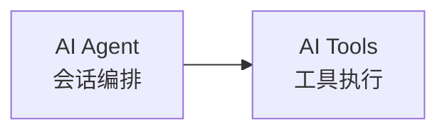
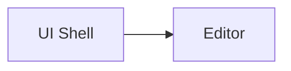

# Mermaid Diagram Rules

Use these rules for durable Mermaid diagrams in PM architecture docs. They adapt the low-dependency safety approach from `awesome-skills/mermaid-syntax-skill` for architecture documentation.

## When To Use Mermaid

Use inline Mermaid code blocks for:

- Module relationship maps.
- System boundary and dependency diagrams.
- Sequence diagrams for cross-module calls.
- Runtime flowcharts and decision flows.
- State transitions.
- Data movement and storage relationships.

Use SVG-first UI diagrams for screen layout, wireframes, and region maps. Use prose or tables when a diagram would be decorative rather than clarifying.

## Diagram Selection

- Use `flowchart LR` for module/dependency maps when left-to-right reading is clearer.
- Use `flowchart TB` for workflows, decision flows, and runtime pipelines.
- Use `sequenceDiagram` for actor/component interactions over time.
- Use `stateDiagram-v2` for lifecycle/state transitions.
- Use `erDiagram` only for durable data relationships.

Prefer one strong diagram over several near-duplicates. Split a diagram when it has too many nodes, too many edge labels, or mixed purposes.

## Syntax Safety Rules

- Prefer `flowchart` over `graph`.
- Use simple ASCII ids such as `uiShell`, `aiAgent`, `noteStore`, or `rustCore`.
- Do not use reserved words as ids: `end`, `default`, `style`, `class`, `classDef`, `linkStyle`, `call`, `href`, `click`, `interpolate`.
- Quote labels containing spaces, Chinese text, punctuation, slashes, parentheses, colons, or line breaks:



- Use `#59;` for literal semicolons in sequence messages.
- Use `%%` for comments.
- Avoid labels that start with bare `o` or `x` after an edge when that could be parsed as a special edge marker.
- Keep subgraph titles quoted when they contain spaces, punctuation, Chinese text, or `<br/>`.
- Avoid advanced or experimental Mermaid syntax unless the target renderer is known to support it.

## PM Architecture Style

- Diagrams must describe current or accepted baseline architecture, not unimplemented plans.
- Keep labels concise. Put longer explanation in nearby prose or tables.
- Prefer neutral labels over decorative icons or emoji for long-lived PM docs.
- Show module ownership and boundaries explicitly when that is the point of the diagram.
- Include only architecture-relevant nodes. Do not turn diagrams into file inventories.
- When diagram facts are inferred rather than verified from code or docs, say so in prose.

## Markdown Integration

Use fenced code blocks:

````markdown

````

Place the diagram near the section it supports. Add a short sentence before or after the diagram stating what the reader should learn from it.

## Lightweight Verification

Before finishing:

- Check that the first non-empty line is a Mermaid diagram declaration.
- Check ids for reserved words.
- Check labels with Chinese text or punctuation are quoted.
- Check comments use `%%`.
- If the diagram is large or likely fragile, simplify the Mermaid rather than switching to ASCII.
- Run the diagram accuracy check from [diagram-validation-rules.md](diagram-validation-rules.md). Fix any inaccurate nodes, edges, labels, or implied flows, then repeat the Mermaid checks.
